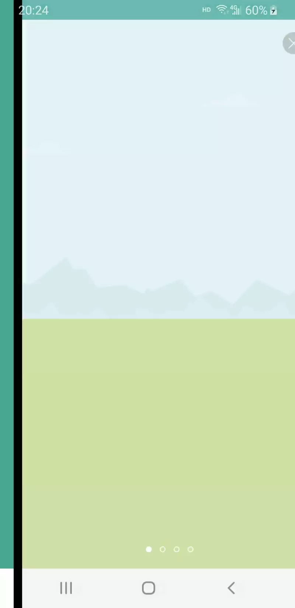
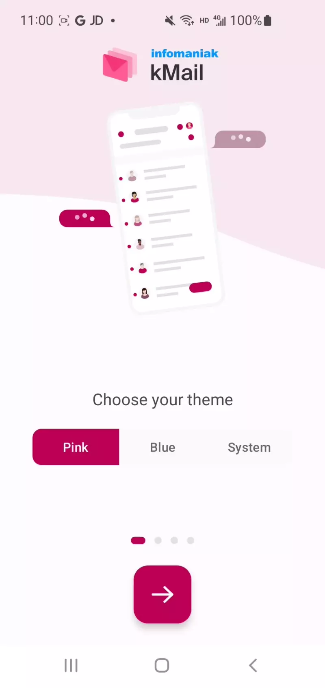
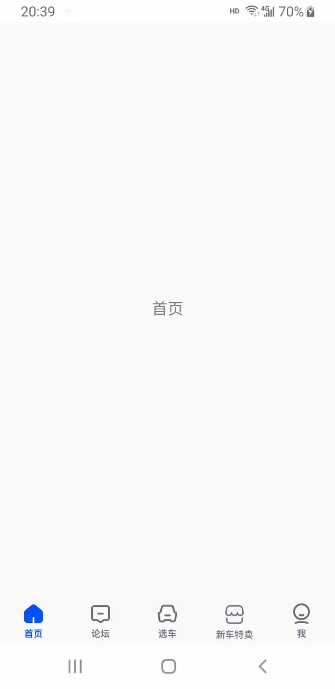
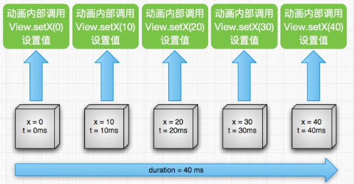
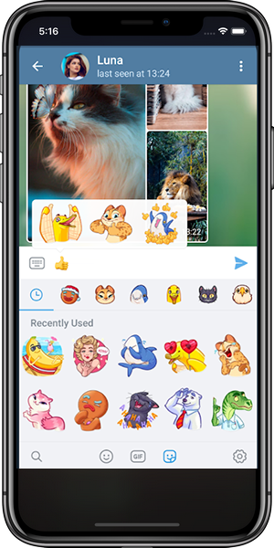
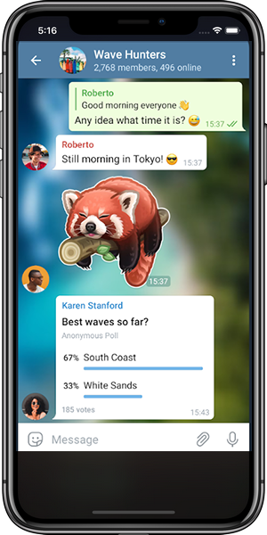

<div align="center">
  
<h1 align="center">Animation</h1>

[](https://play.google.com/store/apps/details?id=com.github.kongpf8848.animation)
[](https://www.apache.org/licenses/LICENSE-2.0)

English | [中文](./README.md)

Collection of various animation effects in Android😊😄😎

</div>

## Download

[](https://play.google.com/store/apps/details?id=com.github.kongpf8848.animation)
[](https://fir.xcxwo.com/animation)

## Screenshots

<div style="display: flex;">
  
  
  
  
  
  
</div>


## Frame Animation

Playing frame by frame，like GIF， sequentially play a pre-defined sequence of images.

```xml
<?xml version="1.0" encoding="utf-8"?>
<animation-list android:oneshot="false" xmlns:android="http://schemas.android.com/apk/res/android">
    <item android:duration="100" android:drawable="@drawable/loading01" />
    <item android:duration="100" android:drawable="@drawable/loading02" />
    <item android:duration="100" android:drawable="@drawable/loading03" />
    <item android:duration="100" android:drawable="@drawable/loading04" />
    <item android:duration="100" android:drawable="@drawable/loading05" />
    <item android:duration="100" android:drawable="@drawable/loading06" />
    <item android:duration="100" android:drawable="@drawable/loading07" />
    <item android:duration="100" android:drawable="@drawable/loading08" />
    <item android:duration="100" android:drawable="@drawable/loading09" />
    <item android:duration="100" android:drawable="@drawable/loading10" />
    <item android:duration="100" android:drawable="@drawable/loading11" />
    <item android:duration="100" android:drawable="@drawable/loading12" />
</animation-list>
```

## Tween Animation

|Animation type|Xml implementation |Code implementation|
|:---:|:---:|:---:|
| AlphaAnimation |alpha |AlphaAnimation|
| ScaleAnimation |scale|ScaleAnimation|
| RotateAnimation |rotate |RotateAnimation|
| TranslateAnimation |translate |TranslateAnimation|

## Property Animation

Animation is implemented by directly changing the properties of the object. Working principle: Within a certain time interval，the value is continuously changed by constantly calling the set method，and this value is continuously assigned to the property of the object，thereby achieving the animation effect of the object on that property. For more information on property animation，please refer to the detailed introduction.[Official document](https://developer.android.google.cn/guide/topics/graphics/prop-animation)



## Transition Animation

One type of animation effect introduced by Google in Android 5.0 and later，the transition from one scene to another in an animated manner in a certain way. You can refer to [Material-Animations](https://github.com/lgvalle/Material-Animations)

## Lottie Animation

Lottie is a cross-platform animation solution introduced by Airbnb. It allows developers directly load JSON animation files on Android、IOS and Web platform. Designers only need to design the animation using After Effects and export it as a JSON file using the Bodymovin plugin provided by Lottie.This file can then be delivered to developers for implementation.[Lottie website](https://lottiefiles.com)

## Tgs Animation

A new sticker format called .tgs has been introduced by the IM software Telegram. This new sticker format is actually based on the lottie JSON file format.[Telegram website](https://telegram.org)

<div style="display: flex;">
  
  
</div>

## GIF

GIF (Graphics Interchange Format) is an image file format developed by CompuServe. It allows multiple images to be saved into a single image file and displayed by sequentially reading and displaying the image data frame by frame on the screen，creating an animation effect. There are several common ways to play GIFs in Android， including:
* ~~Use the android.graphics.Movie class built-in the Android SDK(deprecated)~~
* Using image loading libraries such as [Glide](https://github.com/bumptech/glide) or [Fresco](https://github.com/facebook/fresco)，Glide supports loading GIF images from both local and network sources.
* Using the [giflib](https://android.googlesource.com/platform/external/giflib/+/android-9.0.0_r16) library to decode GIFs at the native layer and using the double-buffering mechanism of [FrameSequenceDrawable](https://android.googlesource.com/platform/frameworks/ex/+/android-9.0.0_r16/framesequence) to draw and display each frame of the GIF.
* Use the [android-gif-drawable](https://github.com/koral--/android-gif-drawable) library，which also uses giflib for GIF decoding at the underlying layer.

## SVGA Animation

SVGA is an animation format that is compatible with Android/iOS/Flutter/Web platforms.[SVGA website](http://svga.io/)


